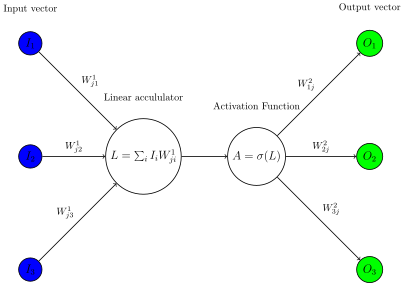
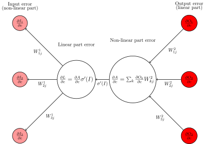
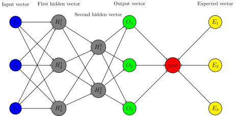
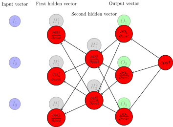

# Backpropagation in four diagrams

Backpropagation is a procedure at the center of deep learning, the method by which gradients of the complex non-linear functions are calculated for all parts of the network. It is often overlooked in explanations of deep learning, especially in the last few years. This is unfortunate, as some very important issues in deep learning techniques, such as the vanishing gradient problem, require a full understanding of backpropagation, while many other techniques and issues require a partial understanding, including Xavier initialization, training memory consumption, and loss scaling for mixed precision training.

I made four diagrams which explain both the high level aspects and the low level aspects of backpropagation using simple and consistent notation and coloring schemes. At the end describing the vanishing gradient problem precisely using actual mathematics, rather than the usual handwaving, will be an easy exercise if you are familiar with the mathematical notation, rather than a serious chore only to be taken on by specialists.

First, forward propagation for a single node. It is simply the sum of a number of weighted scalars in the input , passed through a scalar activation function, and then multiplied by a number of

